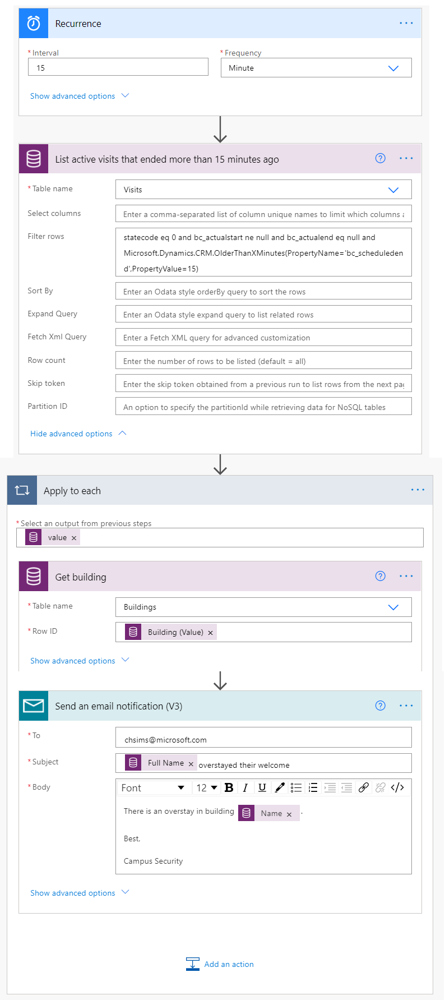

---
lab:
    title: 'لنشاط المعملي 6: كيفية إنشاء حل تلقائي'
   module: 'لوحدة 4: بدء استخدام Power Automate'
---

# الوحدة الرابعة: بدء استخدام Power Automate
## النشاط المعملي: كيفية إنشاء حل تلقائي

### ملاحظة هامة (اعتبارًا من نوفمبر 2020):
تمت إعادة تسمية Common Data Service لتصبح Microsoft Dataverse. وتم تحديث بعض المصطلحات في Microsoft Dataverse. على سبيل المثال، أصبح العنصر الآن جدولًا. ويشار الآن إلى الحقول والسجلات في قواعد بيانات Dataverse على أنها أعمدة وصفوف.

في الوقت الذي تمر فيه التطبيقات بعملية تحديث لتجربة المستخدمين، سنجد أن بعض المراجع لمصطلحات Microsoft Dataverse مثل العنصر (الآن **الجدول**)، والحقل (الآن **العمود**)، والتسجيل (الآن **صف**) قد تكون قديمة. يرجى وضع ذلك في الاعتبار أثناء عملك خلال الأنشطة المعملية. نتوقع تحديث المحتوى بالكامل قريبًا جدًا. 

لمزيد من المعلومات وللحصول على قائمة كاملة بالمصطلحات المتأثرة، يرجى زيارة[ما هو Microsoft Dataverse؟](https://docs.microsoft.com/ar-sa/powerapps/maker/common-data-service/data-platform-intro#terminology-updates)

## السيناريو

Bellows College مؤسسة تعليمية يضم حرمها الجامعي العديد من المباني. يتم حاليًا تسجيل زوار الحرم الجامعي في دفاتر ورقية. ولا يتم جمع المعلومات بشكل متسق، ولا توجد وسيلة لجمع وتحليل البيانات المتعلقة بالزيارات عبر الحرم الجامعي بأكمله. 

ترغب إدارة الحرم الجامعي في تحديث نظام تسجيل الزوار، بحيث يتم التحكم في الوصول إلى المباني من قبل أفراد الأمن، ويجب أن تكون جميع الزيارات مسجلة مسبقًا ويتم تسجيلها من قبل مضيفيها.

خلال هذه الدورة التدريبية، ستقوم بإنشاء تطبيقات وتفعيل التشغيل الآلي لتمكين موظفي إدارة وأمن Bellows College من إدارة الوصول إلى مباني الحرم الجامعي والتحكم فيه. 

في هذا النشاط المعملي، ستنشئ تدفقات Power Automate لأتمتة أجزاء متعددة من إدارة الحرم الجامعي. 

# خطوات معملية عالية المستوى

تم تحديد التالي كمتطلبات يجب عليك تنفيذها لإكمال المشروع:

* يجب توفير الرمز الفريد المخصص لكل زائر قبل زيارته.
* يحتاج أفراد الأمن إلى تلقي إعلامات بالزوار الذين تجاوزوا مددهم الزمنية المحددة.

## المتطلبات الأساسية

* إكمال **الوحدة 0 النشاط المعملي 0 - التحقق من البيئة المعملية**
* إكمال **الوحدة 2 النشاط المعملي 1 - مقدمة إلى Microsoft Dataverse**
* تطبيق Campus Staff الذي تم إنشاؤه في **الوحدة 3 النشاط المعملي 2 – كيفية إنشاء تطبيق اللوحة، الجزء 2** (للاختبار)
* إنشاء جهة اتصال فلان الفلاني باستخدام عنوان بريد إلكتروني شخصي في الوحدة 3 النشاط المعملي 4 - كيفية إنشاء تطبيق يستند إلى نموذج (للاختبار)

## الأشياء الواجب مراعاتها قبل البدء

-   ما أنسب آلية توزيع لرموز الزوار؟
-   كيف يمكن قياس مدد تجاوز الزيارة وتطبيق سياسات صارمة؟

# تمرين \#1: إنشاء تدفق إعلام بالزيارة

**الهدف:** في هذا التمرين، سوف تنشئ تدفق Power Automate ينفذ المتطلبات. ينبغي إرسال بريد إلكتروني للزائر يتضمن الرمز الفريد المخصص للزيارة.

## المهمة \#1: إنشاء تدفق

1.  افتح حل Campus Management.

    -   سجل الدخول إلى<https://make.powerapps.com>

    -   حدد **البيئة** الخاصة بك.

    -   حدد **الحلول**.

    -   انقر لفتح حل **Campus Management**.

2.  انقر فوق **جديد** وحدد **التدفق السحابي**. سيؤدي هذا إلى فتح محرر تدفق Power Automate في نافذة جديدة.

3. ابحث عن *حالي* وحدد موصل **Common Data Service (البيئة الحالية)**.

4. حدد المشغل **عند إنشاء سجل أو تحديثه أو حذفه**.

   * حدد **إنشاء** في **شرط المشغل**
   
   * حدد الزيارات في **اسم الجدول**
   
   * حدد **المنظمة** في **النطاق**
   
   * في خطوة المشغل، انقر فوق علامة الحذف ([...]) وانقر فوق إعادة تسمية. أعد تسمية هذا المشغل **"عند إنشاء زيارة"**. هذه ممارسة جيدة، لذا يمكنك أنت ومحررو التدفق الآخرون فهم الغرض من الخطوة دون الحاجة إلى الخوض في التفاصيل.

5.  انقر فوق **خطوة جديدة**. هذه الخطوة مطلوبة لاسترداد معلومات الزوار، متضمنة عنوان البريد الإلكتروني.

6. ابحث عن *حالي* وحدد موصل **Common Data Service (البيئة الحالية)**.

7. حدد إجراء **الحصول على صف حسب المعرف**. 

   * حدد جهات الاتصال في **اسم الجدول**
   
   * في حقل **معرف الصف**، حدد** الزائر (قيمة)** من قائمة المحتوى الديناميكي.
   
   * في هذا الإجراء، انقر فوق علامة الحذف ([...]) وانقر فوق **إعادة تسمية**. أعد تسمية هذا الإجراء **"الوصول إلى الزائر"**. هذه ممارسة جيدة، لذا يمكنك أنت ومحررو التدفق الآخرون فهم الغرض من الخطوة دون الحاجة إلى الخوض في التفاصيل.

8. انقر فوق **خطوة جديدة**. هذه هي الخطوة التي ستنشئ رسالة بريد إلكتروني وترسلها للزائر.

9. ابحث عن *البريد* وحدد موصل **البريد** وإجراء **إرسال رسالة إعلام بالبريد الإلكتروني** 

   * إذا طُلب منك قبول الأحكام والشروط لاستخدام هذا الإجراء، فانقر فوق قبول.
   
   * حدد الحقل إلى، حدد **البريد الإلكتروني** من قائمة المحتوى الديناميكي. لاحظ أنه يوجد أسفل عنوان **الوصول إلى الزائر**. هذا يعني أنك تختار البريد الإلكتروني المرتبط بالزائر الذي بحثت عنه في الخطوة السابقة. 

   * أدخل زيارتك المجدولة إلى Bellows College في حقل **الموضوع**.

   * أدخل النص التالي في **نص البريد الإلكتروني**:  
        
        > يتعين وضع المحتوى الديناميكي حيث تتم تسمية الحقول بين قوسين. يوصى بنسخ كل النص ولصقه أولاً ثم إضافة المحتوى الديناميكي في الأماكن الصحيحة.
   
        ```
        عزيزي {First Name}،

        من المقرر حاليًا أن تزور حرم Bellows الجامعي بدءًا من {Scheduled Start} حتى {Scheduled End}.

        رمز الأمان الخاص بك هو {Code}، يرجى عدم مشاركته. سيُطلب منك إظهار هذا الرمز أثناء زيارتك.

        أرق التحيات،

        إدارة الحرم الجامعي
        Bellows College
        ```
   
10.  حدد اسم التدفق **بلا عنوان** في الجزء العلوي وأعد تسميته إلى `شعار الزيارة`

11. اضغط على **حفظ**

    اترك علامة تبويب التدفق مفتوحة من أجل المهمة التالية. ينبغي أن يبدو تدفقك كما يلي تقريبًا:


## المهمة \#2: التحقق من صحة التدفق واختباره

1.  افتح علامة تبويب جديدة في متصفحك وانتقل إلى <https://make.powerapps.com>

2.  انقر فوق **التطبيقات** وحدد تطبيق **Campus Staff** الذي أنشأته

3.  بترك علامة التبويب هذه مفتوحة، انتقل مرة أخرى إلى علامة التبويب السابقة التي بها تدفقك. 

4.  في شريط الأوامر، انقر فوق **اختبار**. حدد **يدويًا** ثم **حفظ واختبار**.

5.  بترك علامة تبويب التدفق مفتوحة، انتقل مرة أخرى إلى علامة التبويب السابقة التي بها تطبيق **Campus Staff**.

6.  اضغط على **+** لإضافة سجل زيارة جديد

7.  أدخل **فلان الفلاني** في **الاسم** واختر أي **مبنى**

8.  اختر **فلان الفلاني** ليكون **الزائر**

9.  اختر تواريخ **البداية المجدولة** و**النهاية المجدولة** لأي تواريخ في المستقبل.

10.  اضغط على أيقونة **علامة الاختيار** لحفظ الزيارة الجديدة

11.  انتقل مرة أخرى إلى علامة التبويب السابقة التي بها اختبار التدفق. راقب بينما يتم تشغيل التدفق. إذا كانت هناك أية أخطاء، فارجع وقارن تدفقك بالمثال أعلاه. إذا تم إرسال رسالة البريد الإلكتروني بنجاح، فسوف تستلمه في صندوق الوارد الخاص بك. 

12.  انقر فوق سهم الرجوع في شريط الأوامر

13.  في قسم **التفاصيل**، لاحظ أنه تم تعيين **الحالة** على **تشغيل**. هذا يعني أنه سيتم تشغيل تدفقك كلما يتم إنشاء زيارة جديدة، حتى توقف أنت تشغيله. في أي وقت يتم فيه تشغيل التدفق، ستراه مضافًا إلى قائمة **محفوظات التشغيل لمدة 28 يومًا**.

14.  قم بإيقاف التدفق بالنقر فوق **إيقاف التشغيل** في شريط الأوامر. قد تحتاج إلى الضغط على علامة الحذف ([...]) لرؤية هذا الخيار.

15.  أغلق هذه النافذة.

# تمرين #2: إنشاء تدفق المسح الأمني

**الهدف:** في هذا التمرين، سوف تنشئ تدفق Power Automate ينفذ المتطلبات. يتعين إجراء مسح أمني كل 15 دقيقة، ويجب إعلام الأمن إذا تجاوز أي من الزوار الوقت المجدول.

## المهمة رقم 1: إنشاء تدفق لاسترداد السجلات

1. افتح حل Campus Management.

   -   سجل الدخول إلى<https://make.powerapps.com>

   -   حدد **البيئة** الخاصة بك.

   -   حدد **الحلول**.

   -   انقر لفتح حل **Campus Management**.

2. انقر فوق **جديد** وحدد **التدفق السحابي**. سيؤدي هذا إلى فتح محرر تدفق Power Automate في نافذة جديدة.

3. ابحث عن *التكرار*، وحدد موصل **الجدولة**، ثم حدد مشغل **التكرار**.

4. اضبط **الفاصل الزمني** على **15 دقيقة**

5. انقر فوق **خطوة جديدة**. ابحث عن *حالي* وحدد موصل **Common Data Service (البيئة الحالية)**. حدد إجراء **صفوف القائمة**.

   * أدخل الزيارات ليكون **اسم الجدول**
   
   * انقر فوق **إظهار الخيارات المتقدمة**

   * أدخل التعبير التالي في تصفية الصفوف

   ```
     statecode eq 0 and bc_actualstart ne null and bc_actualend eq null and Microsoft.Dynamics.CRM.OlderThanXMinutes(PropertyName='bc_scheduledend',PropertyValue=15)
   ```
   
   * لتحليلها:
       * **statecode eq 0** يصفي الزيارات النشطة (حيث تكون الحالة نشطة)
       * **bc_actualstart ne null** يقتصر البحث على الزيارات حيث يكون للبداية الفعلية قيمة، أي أنه كان هناك تسجيل وصول
       * **bc_actualend eq null** يقتصر البحث على الزيارات التي لم يوجد فيها تسجيل خروج (النهاية الفعلية ليس لها قيمة) 
       * **Microsoft.Dynamics.CRM.OlderThanXMinutes(PropertyName='bc_scheduledend',PropertyValue=15)** يقصر الزيارات على الزيارات التي كان من المفترض أن تكتمل منذ أكثر من 15 دقيقة.

   * في هذا الإجراء، انقر فوق علامة الحذف (**...**) وانقر فوق إعادة تسمية. أعد تسمية هذا الإجراء إلى **"إدخال الزيارات النشطة التي انتهت منذ أكثر من 15 دقيقة"**. هذه ممارسة جيدة، لذا يمكنك أنت ومحررو التدفق الآخرون فهم الغرض من الخطوة دون الحاجة إلى الخوض في التفاصيل.

6.  انقر فوق **خطوة جديدة**. ابحث عن *تطبيق*، حدد **تطبيق على كل** إجراء 

7.  حدد **القيمة** من محتوى الديناميكيات في حقل **تحديد مخرجات من الخطوات السابقة**. لاحظ أنه يوجد أسفل العنوان الرمادي**إدخال الزيارات النشطة التي انتهت منذ أكثر من 15 دقيقة**. هذا يعني أنك تختار قائمة الزيارات التي بحثت عنها في الخطوة السابقة. 

8.  استرداد بيانات المبنى للسجل ذي الصلة

    * انقر فوق إضافة إجراء داخل حلقة التكرار "تطبيق على الكل".
    
    * ابحث عن حالي وحدد موصل **Common Data Service (البيئة الحالية)**. 
    
    * حدد إجراء الحصول على صف حسب المعرف.
    
    * حدد **المباني** في **اسم العنصر**
    
    * حدد المبنى (قيمة) في **معرف العنصر** من المحتوى الديناميكي
    
    * انقر فوق **...** بجانب **الحصول على سجل**، وحدد **إعادة تسمية**. أدخل **الحصول على مبنى** كاسم الخطوة
    
9.  استرداد بيانات الزائر للسجل ذي الصلة

    * انقر فوق إضافة إجراء داخل حلقة التكرار "تطبيق على الكل".
    
    * ابحث عن حالي وحدد موصل **Common Data Service (البيئة الحالية)**.
    
    * حدد إجراء **الحصول على صف حسب المعرف**.
    
    * حدد جهات الاتصال في **اسم عنصر**
    
    * حدد **الزائر (قيمة)** في **معرف العنصر** من المحتوى الديناميكي
    
    * انقر فوق **...** بجانب **الحصول على سجل**، وحدد **إعادة تسمية**. أدخل **الوصول إلى الزائر** كاسم الخطوة
    
11.  إرسال إعلام بالبريد الإلكتروني

     * انقر فوق إضافة إجراء داخل حلقة التكرار "تطبيق على الكل". إضافة إجراء **إرسال رسالة إعلام بالبريد الإلكتروني** من اتصال **البريد**.

12.  أدخل عنوان بريدك الإلكتروني في **إلى**

13.  أدخل التالي في حقل **الموضوع**. إن **الاسم الكامل** هو محتوى ديناميكي من خطوة **الوصول إلى الزائر**.

   ```
    {Full Name} تجاوز مدة الترحيب
   ```
   
14.  أدخل التالي في حقل **النص**. إن **الاسم** هو محتوى ديناميكي من خطوة **الحصول على مبنى**.

   ```
   يوجد تجاوز لمدة الزيارة في مبنى {Name}.
         
   أرق التحيات،
         
   أمن الحرم الجامعي
   ```

17.  حدد اسم التدفق **بلا عنوان** في الزاوية اليسرى العليا وأعد تسميته إلى **المسح الأمني**

18.  اضغط على **حفظ**

    ينبغي أن يبدو تدفقك كما يلي تقريبًا:



## المهمة رقم 2: التحقق من صحة التدفق واختباره

سيبدأ تدفقك في إرسال رسائل البريد الإلكتروني (إلى البريد الإلكتروني الذي حددته عند إنشاء جهة اتصال فلان الفلاني سابقًا) إذا كانت هناك زيارات تفي بالمتطلبات المنصوص عليها في التدفق.

1. تحقق من أن لديك سجلات زيارة كالتالي:

   1. بها حالة نشطة
   
   2. تاريخ الانتهاء المجدول مضى (بأكثر من 15 دقيقة)
   
   3. البداية الفعلية لها قيمة.
   
   > **ملاحظة**: لعرض هذه البيانات، انتقل إلى make.powerapps.com في علامة تبويب جديدة. انقر فوق الحلول في الجزء الأيسر لتحديد حلك. حدد عنصر الزيارة، ثم حدد علامة التبويب البيانات. انقر فوق الزيارات النشطة في الزاوية العلوية اليمنى لعرض محدد العرض، ثم حدد كل الحقول.
   
2. انتقل إلى تدفق **مسح الأمني**، إذا لم تكن هناك بالفعل.

3. عندما يفتح تدفقك، انقر فوق **اختبار**.

4. حدد **يدويًا**.

5. انقر فوق **حفظ واختبار** و**تشغيل التدفق**.

6. عندما يكتمل التدفق، انقر فوق **تم**. 

7. وسع **تطبيق على الكل**، ثم وسع خطوة **إرسال رسالة إعلام بالبريد إلكتروني**. تحقق من **الموضوع** وقيم **نص البريد الإلكتروني**.

8. حدد السهم الخلفي لتفاصيل تدفق المسح الأمني. حدد **إيقاف التشغيل** على شريط الأوامر. هذا لمنع التدفق من التنفيذ وفقًا لجدول في نظام الاختبار.

# تحديات

* إضافة بداية فعلية ونهاية مجدولة إلى نص البريد الإلكتروني.
* كيف يمكنك ضمان استخدام تنسيق تاريخ سهل الاستخدام في نص البريد الإلكتروني؟
* هل من الممكن إنشاء جدول بمعلومات تجاوز مدة الزيارة وإرسال رسالة بريد إلكتروني واحدة فقط؟
* هل يمكنك إنشاء كود شريطي لرمز الزيارة؟ متى سيكون ذلك مفيدًا؟
